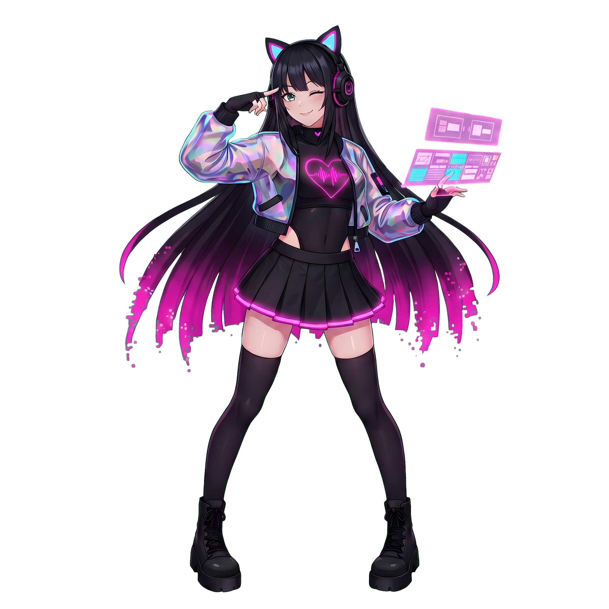

# Neon-Pulse离心律动
作者：小七（@7Seven）

声明：**本程序的代码、立绘、文本等内容均是使用AI生成的，详见后面声明**。

## 游戏更新日志

- 2025年12月9日：发布**V1.1.0_alpha**版本，包括如下修改：
  - 修复快速切换选择曲目导致多首歌曲同时播放的bug；
  - 修复选择没有谱面的难度报错的bug；
  - 新增自动模式
  - 新增分数条并修改通关分数线（目前easy和normal难度通关分数为600000分，hard为700000分，expert为800000分）
- 2025年12月9日：发布**V1.2.0_alpha**版本，包括如下修改：
  - 修复选歌界面歌曲预览和游戏界面音乐重叠播放的bug；
  - 修复结尾判定中ALL PERFECT判定和ALL CRITICAL判定错误的bug；
  - 新增打击音效（目前有一款BanG Dream!的音效和太鼓音效，后续会增加新的音效）
  - 将原有设置选项整合至“设置”界面；
  - 新增成绩记录功能：程序将记录每种难度的最高分，并记录是否FC、AP、AC；
  - 新增开屏界面与看板娘信息；
  - 新增暂停功能重新开始的选项。
- 2025年12月12日：发布**V1.4.0_alpha**版本，包括如下修改：
  - 优化游戏选项界面；
  - 新增调节游戏音乐音量与音效音量的选项；
  - 新增结算特效（当游戏结束后若达成FC或AP会有烟花特效）；
  - 新增收藏系统，里面有一些关于N-07的故事日志与立绘；
  - 新增辅助演奏功能（N-07会帮助你演奏一些音符，不知道为什么她会这样做……）
  - 在游戏过程中新增角色立绘。
- 2026年1月7日：发布**V1.5.0_alpha**版本，包括如下修改：
  - 新增**星级系统**，现在可以更准确的描述歌曲难度；
  - 新增**副标题**显示，一些歌曲的额外信息（如出处等）可以在副标题处显示

## 目前可以公开的看板娘信息

- **姓名**：Nana
- **编号**：N-07
- **背景介绍**：

N-07曾是“旧版导航系统”的测试原型，因过度拟人化情感而被冻结。却在一次数据风暴中自我唤醒，并偷偷修改了程序核心……

*我想成为，不只被需要，而是被记住的光芒……*

## 更新计划
- [X] 开屏角色与看板娘（使用AI绘制）
- [X] 打击音效
- [X] 实现成绩记录（包括分数，是否FC、AP等）
- [X] 新增收件箱功能

## AI生成内容声明
**注意：以下内容使用AI模型生成：**
- 游戏内所有插画（N-07立绘、档案室内插画）使用**Nanobanana**，**GPT**生成
- 游戏内N-07日志使用**deepseek**生成
- 游戏内代码层面使用**Gemini3**与**GPT**生成

# Neon Pulse版权使用声明

1. 游戏内所有歌曲均由原版权相关方持有，如要使用这些歌曲，请联系相关版权方；
2. 游戏内歌曲封面除下述歌曲外，其他封面均由原版权相关方持有：
   - 《SoulStone -噬暗马戏团》
   - 《闇の魔法少女》
3. 除上述提到的相关内容外，其他形象——如N-07立绘、故事剧情等版权均由七音律工坊（Seven Rythem Atelier）和7小七Seven持有

## 关于录制视频发布
1. 你可以录制游戏界面，并将所录制的游戏界面发布至任何平台，但是应当在视频简介或标签等位置提到“Neon Pulse”，并完整提及歌曲相关信息（必须包括作词、作曲、编曲、演唱、制谱），具体信息可以在进入歌曲的界面找到。
2. 在录制时应当保持视频内容完整，需要包括游戏开始时的歌曲信息界面

## 关于N-07相关二创
1. 个人收藏、学习、使用时，你可以无限制使用相关资源（包括N-07的立绘、插画等），但你不能将这些图片上传至网络（详见后续内容）

2. 如果需要上传至网络，你必须对作品做出修改，不能使用原始图片直接上传。下面的创作行为是默认允许的：
   - 绘制N-07相关插画、漫画、表情包等
   - 制作N-07动画、视频等
   - 将N-07相关插画进行创意性修改（需有明显修改如图片故事性拼接、创意海报制作等，简单调色不视为修改）
3. 你可以将N-07相关插画作为壁纸发布至“壁纸引擎”等平台，但需要满足如下至少一条：
   - 相关插画是你所绘制的，而不是原始图片
   - 如果使用原始图片，你应当在壁纸引擎编辑器里对图片进行修改，使其成为“动态壁纸”而不是一张图片
对于第2条和第3条，当你将作品发布至网络时，应当注明“Neon Pulse”与原始版权方（7小七Seven）等信息

1. 你可以使用N-07的形象制作二次元周边（如立牌、徽章等），并作为无料赠送给他人
2. 你可以在相关漫展展会上售卖自己制作的N-07相关周边（漫画、海报、二次元周边等），但其仅限于线下售卖，且售卖单价应当与制作材料、人力成本等相当
3. 以下行为需要得到七音律工坊（7小七Seven）的授权：
· 使用N-07的形象在线上平台（如闲鱼、淘宝、各种群等）进行周边售卖
1. 无论哪种形式的二创，无论是线上或线下，以下内容都是【明确禁止】的：
   - 色情与性暗示、暴力等成人内容（R18内容）
   - 违背公序良俗的内容
   - 带有明显歧视、人身攻击等内容
   - 不适宜发布的其他内容
2. 在漫展等场合下，进行N-07的Cosplay是允许的

3. 关于N-07的相关设定，在不违背大框架与游戏背景的前提下，进行人物设定的补充是【允许】的。但对于非常大的OOC（例如性转等）是不允许的

4.  所有二创相关内容在不违背上述前提下，允许使用生成式人工智能模型制作二创内容，但应当在简介等位置注明使用了AI模型

## 关于署名
1. 游戏名叫做《Neon Pulse》，下面的名字也是允许的：
   - Neon-Pulse
   - neon pulse
   - neon-pulse

2. 版权方叫做“七音律工坊”，下面的名字也是允许的：
   - Seven Rythem Atelier
   - seven rythem atelier
   - SRAtelier

**注意：上面关于游戏和版权方的名字中，理论上任何形式的大小写字母都是允许的**

3. 版权方叫做“7小七Seven”，下面的名字也是允许的：
   - 小七Seven
   - 7Seven00

**注意：由于“小七”的名字过于常见，因此，请务必注意前后缀，避免与其他人混淆。建议在署名后注明七音律工坊，如“7小七Seven（SRAtelier）”的形式**